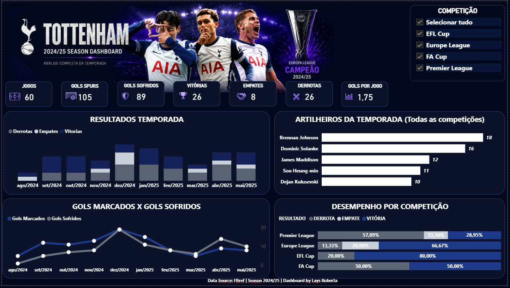
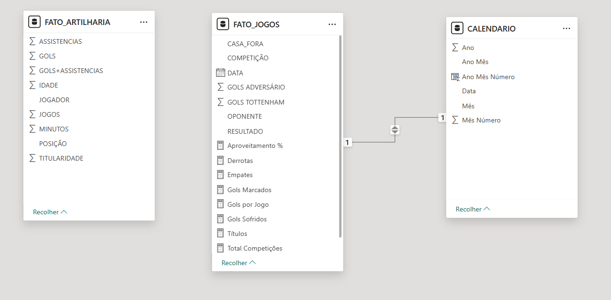

# Tottenham Hotspur 2024/25 — Business Intelligence Dashboard


---

# 📊 Dashboard

<p align="center">



</p>

---

# Sobre o projeto

Este projeto consiste na construção de uma solução completa de Business Intelligence para análise da temporada **2024/25 do Tottenham Hotspur**.

Diferente da primeira versão do dashboard, este projeto foi totalmente reconstruído, contemplando desde a coleta dos dados até a modelagem dimensional em banco de dados relacional.

Todo o fluxo foi desenvolvido simulando um cenário real de BI utilizado em empresas.

---

# Objetivos

- Praticar SQL Server
- Modelagem dimensional
- Construção de Data Warehouse
- Consultas SQL
- Power BI
- Storytelling com dados
- Visualização de indicadores

---

# Pipeline do Projeto

```text
                FBref
                  │
                  ▼
         Coleta dos dados
                  │
                  ▼
          SQL Server Database
                  │
     ┌────────────┴────────────┐
     ▼                         ▼
Tabela Fato              Tabelas Dimensão
     │                         │
     └────────────┬────────────┘
                  ▼
          Modelagem Power BI
                  │
                  ▼
          Dashboard Final
```

---

# Estrutura do Projeto

```
tottenham-2024-25-data-analysis

│
├── Dashboard
│     ├── Tottenham Dashboard.pbix
│
├── SQL
│     ├── Create Database.sql
│     ├── Create Tables.sql
│     ├── Inserts.sql
│     ├── Consultas.sql
│
├── Data
│     ├── Jogos.csv
│     ├── Artilharia.csv
│
├── Images
│     ├── dashboard.png
│     ├── modelo.png
│     ├── sqlserver.png
│
└── README.md
```

---

# 🗄 Modelagem do Banco de Dados

O projeto foi estruturado utilizando modelagem dimensional.

## Tabelas Fato

- FATO_JOGOS
- FATO_ARTILHARIA

## Dimensões

- DIM_COMPETICAO
- DIM_DATA
- DIM_JOGADOR
- DIM_OPONENTE
- CALENDARIO

---

## Modelo Relacional

<p align="center">



</p>

---

# SQL Server

Toda a estrutura do banco foi construída no SQL Server.

Foram desenvolvidas consultas para:

- criação das tabelas
- carga dos dados
- consultas analíticas
- agregações
- integração com o Power BI

<p align="center">


</p>

---

# Indicadores

O dashboard apresenta indicadores como:

✅ Jogos

✅ Vitórias

✅ Empates

✅ Derrotas

✅ Gols Marcados

✅ Gols Sofridos

✅ Média de Gols

✅ Resultados por mês

✅ Artilheiros

✅ Desempenho por competição

---

# Dashboard

### Visão Geral

<p align="center">


</p>

---

# Tecnologias

- SQL Server
- SQL
- Power BI
- Power Query
- DAX

---

# Fonte dos dados

Todos os dados foram obtidos através do

**FBref**

https://fbref.com/

---

# Principais aprendizados

Durante o desenvolvimento deste projeto foram aplicados conceitos de:

- Modelagem Dimensional
- Star Schema
- SQL
- DAX
- Storytelling
- Data Visualization
- Business Intelligence
- Power BI

---

# Próximas evoluções

- Atualização automática dos dados
- Novas páginas analíticas
- Estatísticas por jogador
- Publicação no Power BI Service

---

# Autor

**Lays Roberta da Silva**

LinkedIn:
www.linkedin.com/in/lays-roberta-silva

GitHub:
https://github.com/LaysRobertaS


